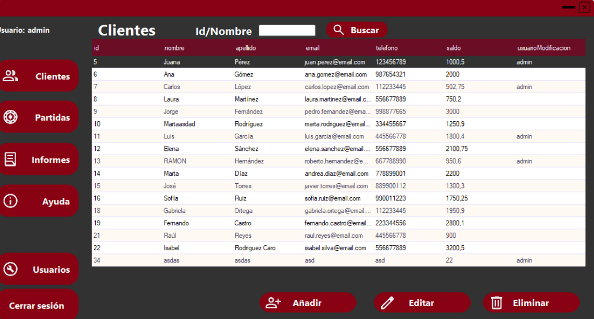

<h1 style="text-align: center; color: #333;">🎰 CasinoManager 🎰</h1>

    Una <strong>aplicación de escritorio para Windows</strong> desarrollada en <strong>C# con WinForms</strong> que permite la
    <strong>gestión integral de un casino</strong>: usuarios, clientes, partidas y generación de informes.

<h2 style="color: #007bff; border-bottom: 2px solid #007bff; padding-bottom: 5px;">🛠️ Funcionalidades Principales</h2>

<ul style="list-style-type: none; padding-left: 0;">
    <li style="margin-bottom: 1em;">
        <strong>&#10003; Inicio de Sesión Seguro:</strong> Acceso diferenciado para <strong>administradores</strong> y <strong>usuarios normales</strong>. Las contraseñas se almacenan cifradas mediante <strong>Bcrypt</strong>. 🔐
    </li>
    <li style="margin-bottom: 1em;">
        <strong>&#10003; Gestión de Usuarios:</strong> Alta, modificación y control de <strong>usuarios del sistema</strong>, con control de roles y trazabilidad. 👥
    </li>
    <li style="margin-bottom: 1em;">
        <strong>&#10003; Administración de Clientes:</strong> Registra clientes con <strong>nombre, email, teléfono y saldo</strong>. Control total desde una interfaz intuitiva. 💳
    </li>
    <li style="margin-bottom: 1em;">
        <strong>&#10003; Registro de Partidas:</strong> Guarda datos de partidas jugadas: <strong>cliente, juego, apuesta y ganancia</strong>. 🎮
    </li>
    <li style="margin-bottom: 1em;">
        <strong>&#10003; Generación de Informes:</strong> Informes personalizados con <strong>Microsoft Report Viewer</strong> según necesidades administrativas. 📊
    </li>
    <li style="margin-bottom: 1em;">
        <strong>&#10003; Interfaz Moderna:</strong> Diseñada con <strong>Guna UI 2</strong> para una experiencia fluida y estética en Windows. 🎨
    </li>
</ul>

<h2 style="color: #007bff; border-bottom: 2px solid #007bff; padding-bottom: 5px;">🧱 Tecnologías Utilizadas</h2>

<ul style="list-style-type: disc; padding-left: 20px;">
    <li style="margin-bottom: 0.5em;"><strong>Lenguaje:</strong> <strong>C#</strong></li>
    <li style="margin-bottom: 0.5em;"><strong>Framework:</strong> <strong>.NET Framework con WinForms</strong></li>
    <li style="margin-bottom: 0.5em;"><strong>Base de Datos:</strong> <strong>MySQL</strong> alojada en AWS RDS</li>
    <li style="margin-bottom: 0.5em;"><strong>Interfaz UI:</strong> <strong>Guna UI 2</strong></li>
    <li style="margin-bottom: 0.5em;"><strong>Seguridad:</strong> <strong>Bcrypt</strong> para encriptación de contraseñas</li>
    <li style="margin-bottom: 0.5em;"><strong>Generación de Informes:</strong> <strong>Microsoft Report Viewer</strong> 📄</li>
    <li style="margin-bottom: 0.5em;"><strong>Gestión de Código:</strong> GitHub para versionado y trabajo en distintos dispositivos</li>
</ul>

<h2 style="color: #007bff; border-bottom: 2px solid #007bff; padding-bottom: 5px;">📸 Capturas de Pantalla</h2>

<table style="width: 100%; border-collapse: collapse; text-align: center;">
    <tr>
        <td style="padding: 10px; vertical-align: top; width: 33.33%;">
            <h3 style="color: #343a40; margin-bottom: 0.5em; font-size: 1.1em;">➡️ Inicio de Sesión</h3>
            
        </td>
        <td style="padding: 10px; vertical-align: top; width: 33.33%;">
            <h3 style="color: #343a40; margin-bottom: 0.5em; font-size: 1.1em;">➡️ Pantalla Principal</h3>
            
        </td>
        <td style="padding: 10px; vertical-align: top; width: 33.33%;">
            <h3 style="color: #343a40; margin-bottom: 0.5em; font-size: 1.1em;">➡️ Clientes</h3>
            
        </td>
    </tr>
    <tr>
        <td style="padding: 10px; vertical-align: top; width: 33.33%;">
            <h3 style="color: #343a40; margin-bottom: 0.5em; font-size: 1.1em;">➡️ Añadir clientes</h3>
            
        </td>
        <td style="padding: 10px; vertical-align: top; width: 33.33%;">
            <h3 style="color: #343a40; margin-bottom: 0.5em; font-size: 1.1em;">➡️ Informes</h3>
            
        </td>
        <td style="padding: 10px; vertical-align: top; width: 33.33%;">
            <h3 style="color: #343a40; margin-bottom: 0.5em; font-size: 1.1em;">➡️ Editar Partida</h3>
            
        </td>
    </tr>
</table>
